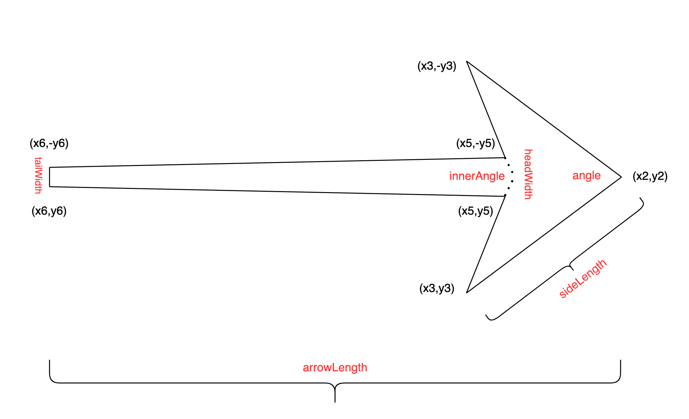
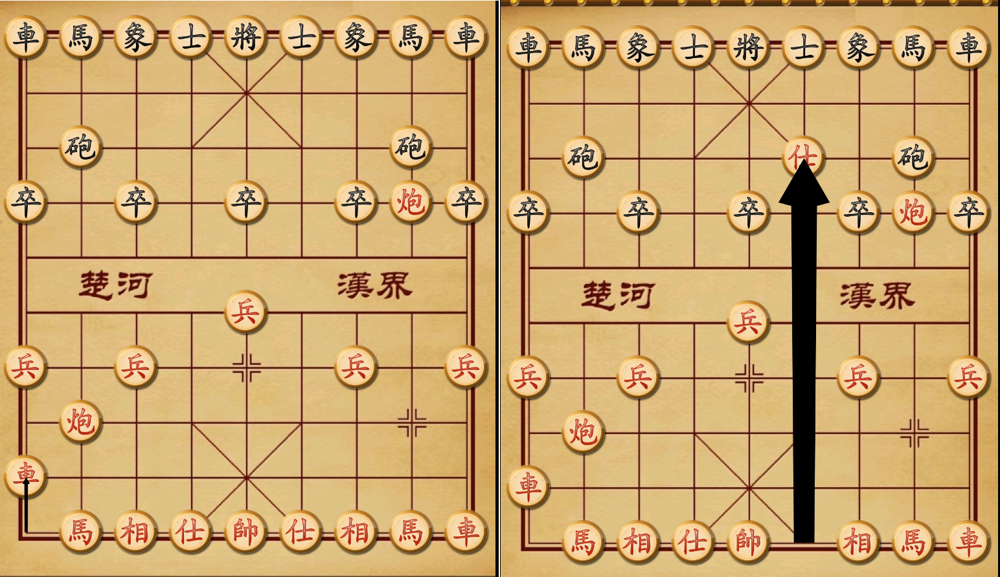

# 绘制箭头

在java里，如何绘制一个箭头呢？

## 箭头的定义



从上面可以看出来，一个箭头可以由6个参数来决定：

* 箭头的长度 arrowLength (不使用)
* 箭头的角度 angle
* 箭头的斜边长 sideLength
* 箭头的内角度 innerAngle
* 头部的宽度 headWidth
* 尾部的宽度 tailWidth

注意：为了保持箭头的形状，一般不成比例的放大缩小箭头，而是根据需要只调整箭头的长度，不改变箭头的形状。成比例缩放箭头效果如下：



所以 **箭头的长度arrowLength在计算的时候不会使用**


这几个参数决定好以后，整个箭头的形状就可以由4个点来决定了：

```
(x2,y2)
(x3,y3)
(x5,y5)
(x6,y6)
```

具体的计算可以参考下面的代码。

利用Matrix功能，就可以把这个箭头绘制到任何想要的起点和终点上了。

## java的绘制代码

### 生成Path曲线

```
package com.zfdang.chess.utils;

import android.graphics.Matrix;
import android.graphics.Path;

/*
 * ArrowShape.java
 * 设置箭头的参数，然后生成箭头的Path
 * 具体的参数可以参考这个文档：
 * https://github.com/zfdang/chinese-chess-android/blob/master/docs/%E7%BB%98%E5%88%B6%E7%AE%AD%E5%A4%B4.md
 * Created by zfdang on 2018-03-25
 */
public class ArrowShape {
    float angle;
    float innerAngle;
    float sideLength;
    float headWidth;
    float tailWidth;

    public ArrowShape(float angle, float innerAngle, float length, float sideLength, float headWidth, float tailWidth) {
        this.angle = angle;
        this.innerAngle = innerAngle;
        this.sideLength = sideLength;
        this.headWidth = headWidth;
        this.tailWidth = tailWidth;
    }

    public ArrowShape() {
        this.angle = 60;
        this.innerAngle = 120;
        this.sideLength = 70;
        this.headWidth = 18;
        this.tailWidth = 12;
    }

    public void getTransformedPath(Path path, float x0, float y0, float x1, float y1) {

        double angle1 = this.angle / 360 * Math.PI;
        double angle2 = this.innerAngle / 360 * Math.PI;
        float sinv1 = (float) Math.sin(angle1);
        float cosv1 = (float) Math.cos(angle1);
        float tanv2 = (float) Math.tan(angle2);

        // 直接设置箭头的长度为目标长度，避免缩放时箭头变形
        float x2 = (float) Math.hypot(x1 - x0, y1 - y0);
        float y2 = 0;

        // (x3, y3)
        float x3 = (float) (x2 - sideLength * cosv1);
        float y3 = (float) (y2 - sideLength * sinv1);

        // (x5, y5)
        float x5 = (float) (x3 + sideLength * sinv1 / tanv2 - headWidth / 2 / tanv2);
        float y5 = -headWidth / 2;

        // (x6, y6)
        float x6 = 0;
        float y6 = -tailWidth / 2;

        path.reset();
        path.moveTo(x2, y2);
        path.lineTo(x3, y3);
        path.lineTo(x5, y5);
        path.lineTo(x6, y6);
        path.lineTo(x6, -y6);
        path.lineTo(x5, -y5);
        path.lineTo(x3, -y3);
        path.close();

        Matrix mtx = new Matrix();
        mtx.postRotate((float) (Math.atan2(y1 - y0, x1 - x0) * 180 / Math.PI));
        mtx.postTranslate(x0, y0);
        path.transform(mtx);
    }
}

```

### 绘制曲线

```
    void DrawArrow(Canvas canvas, XYCoord crd0, XYCoord crd1, Paint p) {
        ArrowShape arrow = new ArrowShape();
        Path path = new Path();
        arrow.getTransformedPath(path, crd0.x, crd0.y, crd1.x, crd1.y);

        canvas.drawPath(path, p);
    }
```


